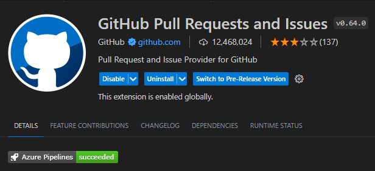
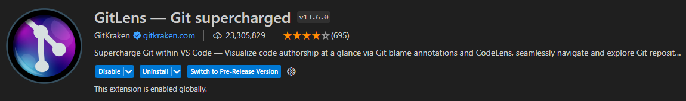

# Adding VS Code Extensions for Git.

Install the following extensions in VSCode

1. GitHub Pull Request and Issues

    This extension allows you to review and manage GitHub pull requests and issues in Visual Studio Code.

    

2. GitLens - Git supercharged

    GitLens supercharges Git inside VS Code and unlocks untapped knowledge within each repository. It helps you to visualize code authorship at a glance via Git blame annotations and CodeLens, seamlessly navigate and explore Git repositories, gain valuable insights via rich visualizations and powerful comparison commands, and so much more.

    

   
You may return to [task.md](../TASKS.md#1-setting-up-the-pre-requisites)