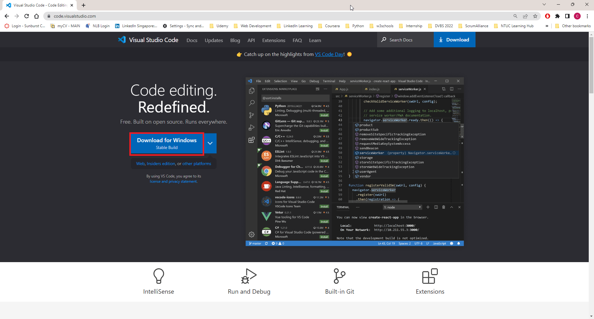
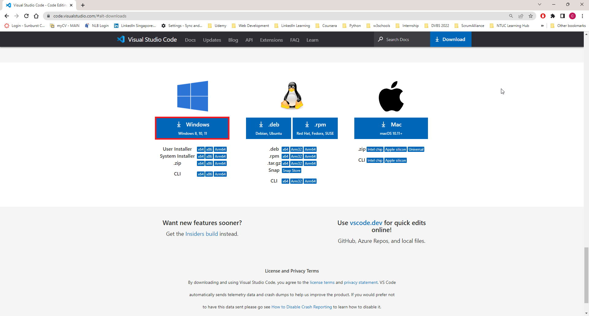

# Download and install the Visual Studio Code (VSC) Application.

* To download the installer, you can click on the button (*boxed in red*) below at https://code.visualstudio.com/

   

Alternatively, you could click on the button (*boxed in red*) below at https://code.visualstudio.com/#alt-downloads

   

* After downloading the installer, run the *VSCodeUserSetup-x64-1.77.3.exe* file to proceed with the installation.

* Note: During the installation setup, remember to tick the folllowing checkboxes below:

   * Add "Open with Code" action to Windows Explorer file context menu
   * Add "Open with Code" action to Windows Explorer directory context menu

You may return to [task.md](../TASKS.md#3-getting-started---begin-collaborating-cloning-global-repository-to-local-device)