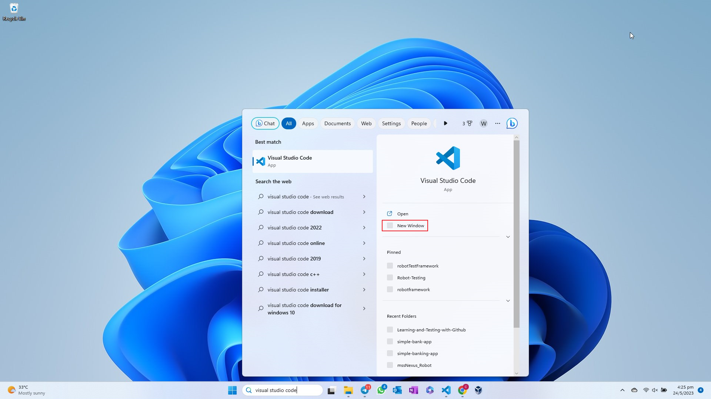
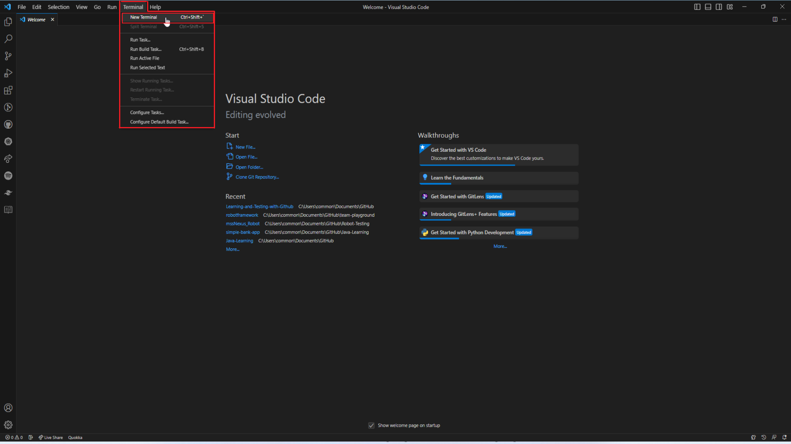
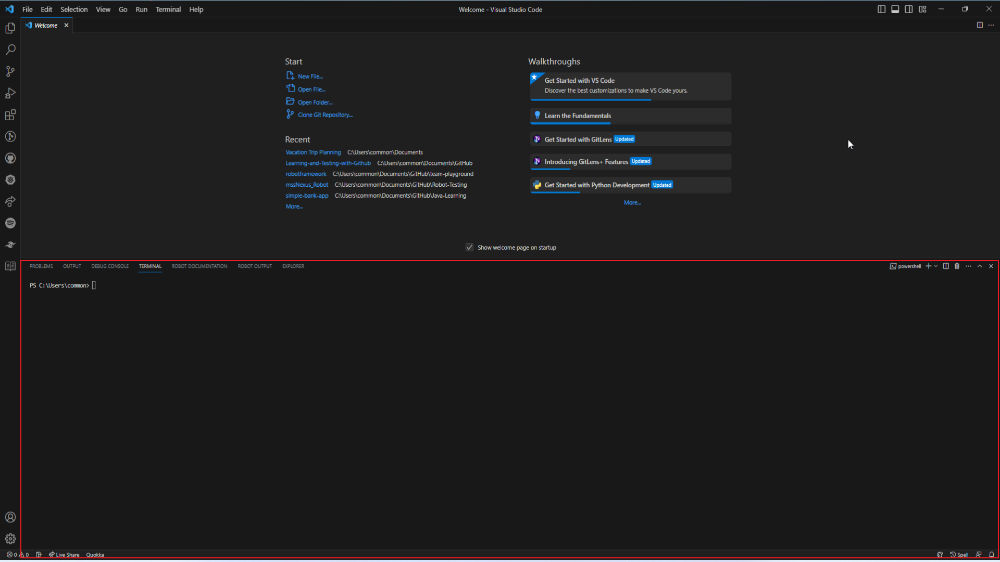
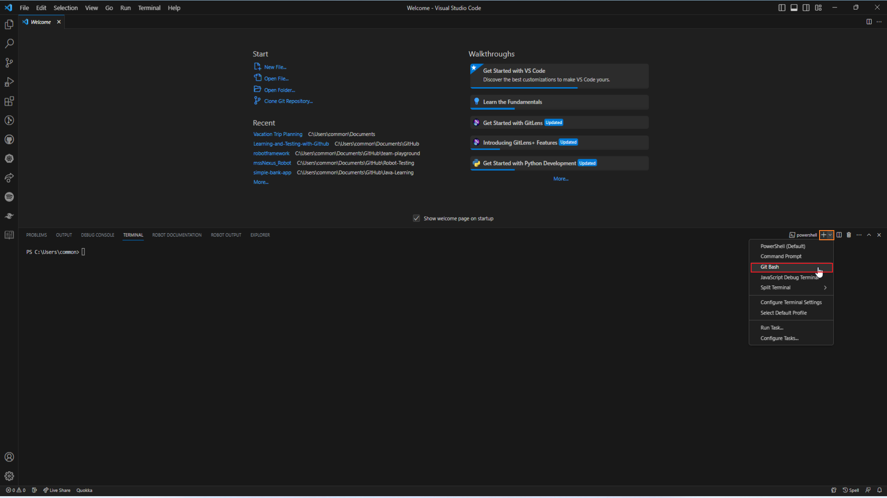
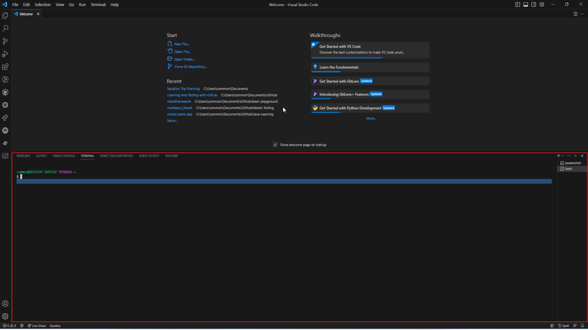
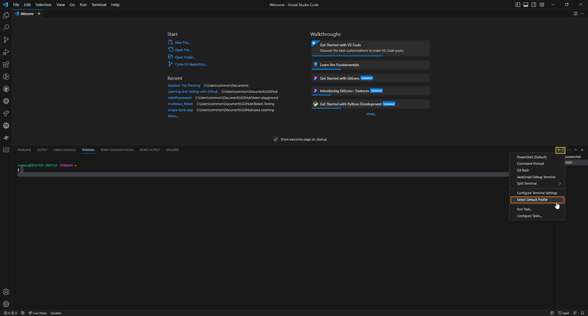
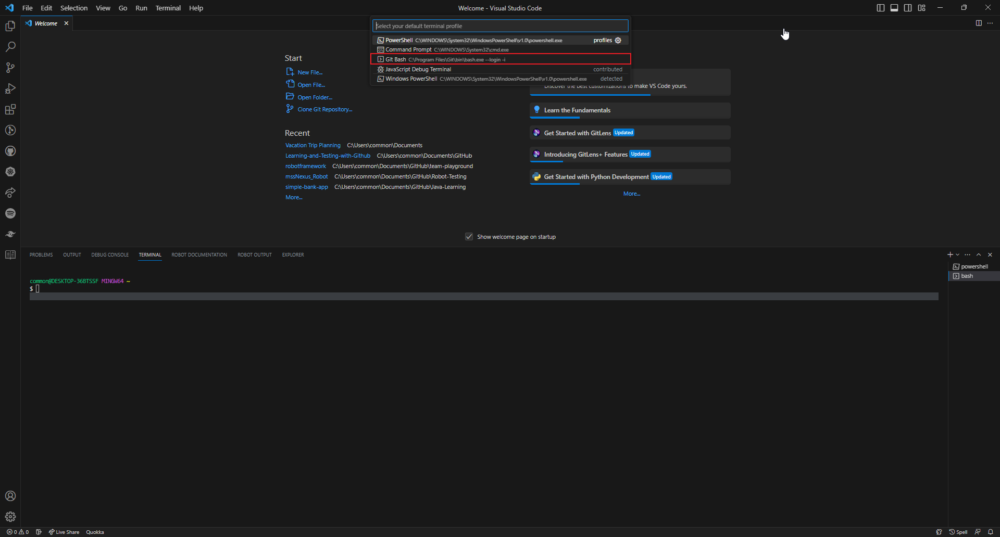
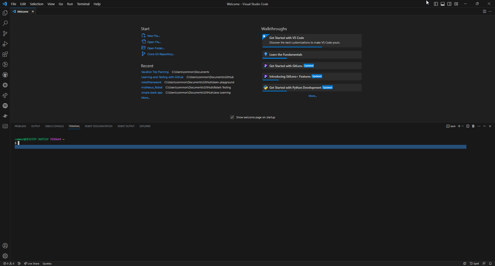

# Opening the Git Bash Terminal in Visual Studio Code (VSC) Application.

## Steps to Open the Git Bash Terminal:

1. Before you proceed on, ensure that you have the [Visual Studio Code (VSC) Application installed](../1.%20Setting%20up%20the%20Pre-requisites/Download%20and%20Install%20Visual%20Studio%20Code.md) on your local device.

2. Open up a New Window for your Visual Studio Code Application

   

3. Under the Menu Bar of your Visual Studio Code Application, click on Terminal and then on New Terminal. 
   (Alternatively, you could use the **Ctrl + `** keyboard shortcut with the backtick character to show or hide the Terminal window.)

   

   The terminal will be displayed at the bottom of the Window. (By default, the powershell terminal will be opened.)

   

4. Click on the "Add Terminal Profile" icon button (yellow outline box) and then on Git Bash (red outline box)

   

   Then, the git terminal profile will appear.

   

5. (OPTIONAL) You can click on the "Add Terminal Profile" icon button (yellow outline box) >> Select Default Profile (orange outline box) >> Git Bash (red outline box). With this, the default terminal for each new terminal window will be Git Bash.

   

   

   

You may return [here](../../README.md#4-planning-for-the-trip---collaboration)