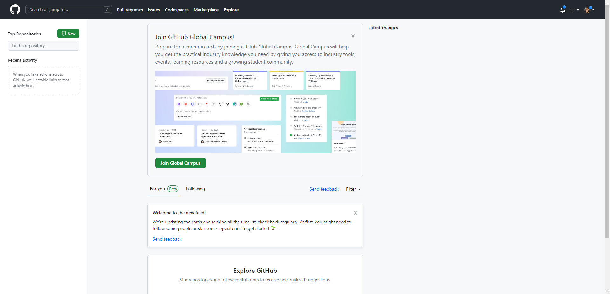
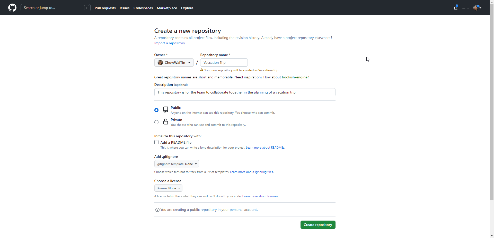

# Initialise (Create) A Remote Repository on GitHub Webpage

1. Login to [GitHub](https://github.com/login)

    

2. Click on  

    

3. Create the Repository:
    * Entering a Name
    * Entering a Description (Optional)
    * Choose if the repository should be Public or Private
    * Add a README.md file (This is a Markdown file that provides a brief introduction or documentation about your project.)
    * Add a .gitignore file (This file contains a list of files and directories that Git should ignore when tracking changes. This is useful for preventing Git from tracking sensitive information, build artifacts, or temporary files.)
    * Choose a License (This file contains the license that applies to your project, which specifies how others can use, modify, and distribute your code.)

    

    * Note: For this tutorial, we will only be entering a name and description, and choose the repository to be public