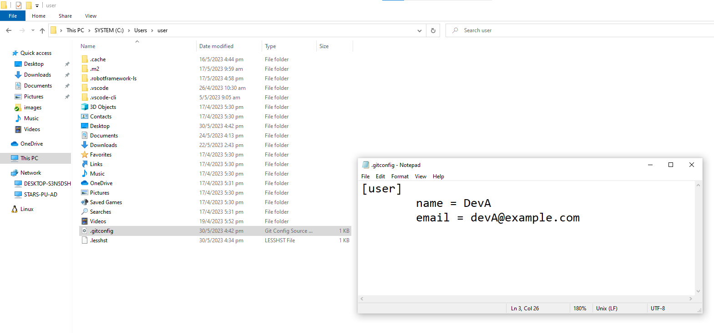

# Configure Global Settings for Git

## Benefits for configuring global Git settings:

1. Consistent User Identity:

    * By setting your name and email globally using git `config --global user.name` and `git config --global user.email`, Git will automatically associate your commits with the correct user information across all repositories. This helps maintain consistency and ensures accurate attribution of commits.

2. Default Branch Name: 

    * Configuring the `init.defaultBranch` setting globally allows you to specify the default branch name for new repositories. For example, setting it to main ensures that newly created repositories use "main" as the default branch, promoting the adoption of more inclusive branch names.

3. Preferred Editor: 

    * Setting the `core.editor` configuration globally allows you to define your preferred text editor for writing commit messages, resolving conflicts, and performing other Git operations. This ensures a consistent experience across all repositories.

4. Aliases and Customizations: 

    * Global Git settings allow you to define aliases and custom configurations that can significantly improve your Git workflow. For instance, you can create shortcuts for frequently used commands, define custom merge strategies, or configure various options to suit your preferences.

5. Efficiency and Ease of Use:

    * By configuring global settings, you can avoid repeating the same configurations for each repository you create. This saves time and effort, making it easier to set up new repositories and start working with Git quickly.

It's worth noting that global Git settings can be overridden by repository-specific settings. So, while global settings provide convenient defaults, you can still customize settings on a per-repository basis if needed.

Overall, configuring global Git settings allows you to establish consistent behaviors, streamline your workflow, and personalize Git according to your preferences.

## Steps to Configuring your Git Settings:

`*If you are using the Git Bash terminal in VS Code, you can skip the step below as the terminal should be navigated to the correct repository*`

Firstly, navigate to the cloned repository's directory using the cd command:
```
    cd <repository_directory>
```

`** "Show Hidden Items" checkbox should be CHECKED to see the .git folder **`


* For this example, we will be setting the Git Global Settings:
    
    - Name and Email: 
        
        * You can set your name and email address using the following Git commands in the command prompt:
            ```
            git config --global user.name "Dev_A"
            git config --global user.email "devA@example.com"
            ``` 

            

        `You can usually find the global config file in the "C:\Users\user\.git" folder.`

        `If not, use the following command to get your config file.`
        ```
        git config --list --show-origin
        ```

        After setting the name and email address, the global config file should contain the correct information as shown below.

        

* If you wish to have a different local config for the local repository, you can change the settings of the following:

    - Name and Email:
        * You can set your name and email address using the following Git commands in the command prompt:
            ```
            git config user.name "Local_Dev_A"
            git config user.email "LocalDevA@example.com"
            ``` 

            

        `You can find the local config file in the .git folder of your local repository directory.`

        After setting the name and email address, the local config file should contain the correct information as shown below.

        

You may return [here](../../README.md#2-getting-started---initialise-a-repository-for-the-project-create-a-shared-folder-for-collaboration)