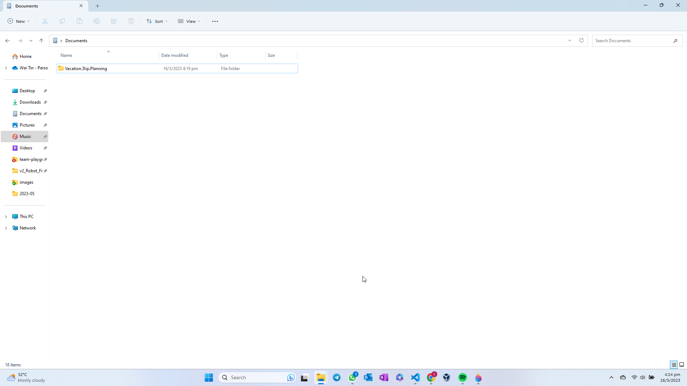
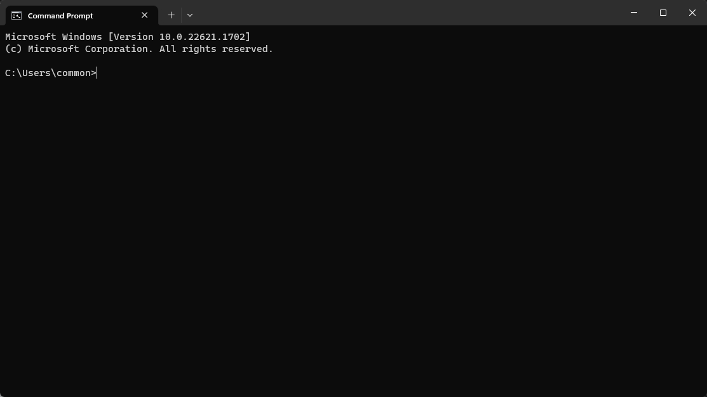
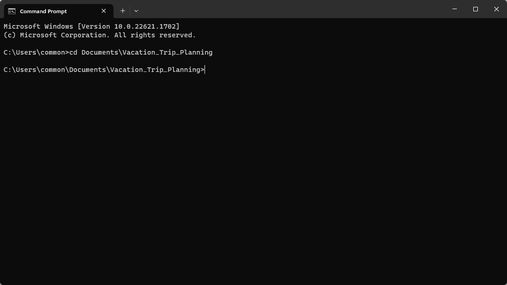

# Initialise (Create) A Local Git Repository on Local Device

## Steps to Create a Local Repository (Folder) on a Local Device
1. Choose a directory to store your local repository (i.e. Vacation Planning Trip):
    * This can be any folder on your local device.
    * E.g. : Choosing Documents ( *Highlighted in Red* ) the Directory to store your Local Repository

        

2. Right-Click > Select  > Select  (i.e. Vacation Planning Trip):

    

3. Rename the Folder to your preference
    * E.g. Vacation Trip Planning

        

4. Initialise Created Folder as a Git Repository

    * Open up the terminal or command prompt on your local device

        

    * Navigate to the directory where you wish to create the repository

        

    * Once you're in the desired directory, run the following command to initialize a new Git repository

        