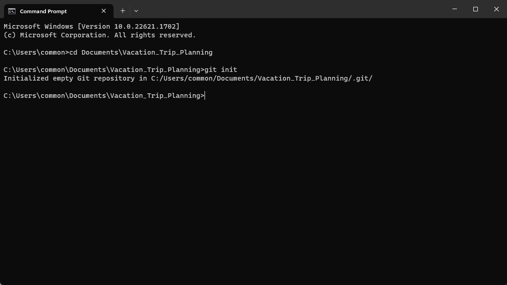

# Initialise (Create) A Local Git Repository on Local Device

## Purpose of A Local Git Repository
* Track changes: 
    * Git keeps a record of all changes made to your project's files over time. It allows you to see what modifications were made, when they were made, and who made them. This history of changes helps you understand the evolution of your project and allows you to revert to previous versions if needed.

* Collaborate and work offline:
    * Having a local Git repository allows you to work on your project even without an internet connection. You can make changes, create commits, and switch between branches locally. This is particularly useful when you're working remotely or in environments with limited or no internet access.

* Experiment and branch: 
    * Git enables you to create branches, which are independent lines of development. Branches allow you to experiment with new features, work on different tasks simultaneously, or isolate changes without affecting the main codebase. You can easily switch between branches, merge them, or discard them as needed.

* Safeguard your work: 
    * By having a local Git repository, you ensure that your project's files are stored safely on your local device. It acts as a backup mechanism, protecting against accidental file loss or corruption. Additionally, Git's distributed nature allows you to have multiple copies of the repository, providing redundancy which further safeguards your work.

* Revert and roll back changes: 
    * Git provides the ability to revert changes and roll back to a previous state of your project. If you encounter a bug or need to undo a set of changes, you can selectively revert specific commits or reset the entire project to a previous state.

* Maintain a project's integrity: 
    * With Git, you can enforce good development practices by organizing your commits into logical units and ensuring that each commit represents a meaningful change. This helps in maintaining a clean commit history and facilitates collaboration with other developers.

## Steps to Create a Local Git Repository (Folder) on a Local Device
1. Choose a directory to store your local repository (e.g. Vacation Planning Trip):
    * This can be any folder on your local device.
        * E.g. : Choosing Documents *(Highlighted in Red)* to be the Directory to store your Local Repository

        

2. Right-Click > Select  > Select  (e.g. Vacation Planning Trip):

    

3. Rename the Folder to your preference
    * E.g. Vacation Trip Planning

        

4. Initialise Created Folder as a Git Repository

    * Open up the terminal or command prompt on your local device

        

    * Navigate to the directory where you wish to create the repository

        

    * Once you're in the desired directory, run the following command to initialize a new Git repository
        ```
        git init
        ```

        