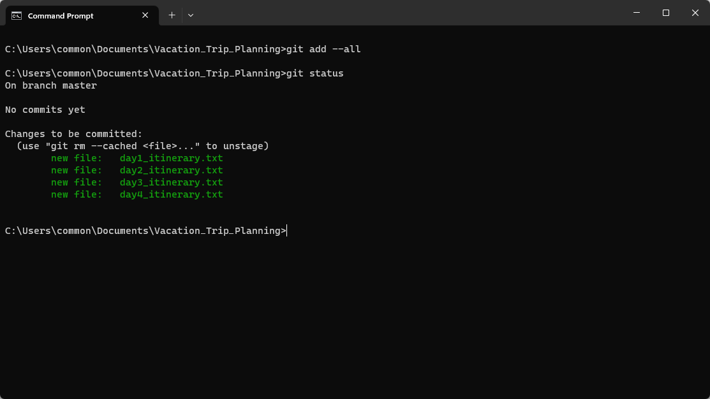

# Making Initial Commits (Initialise Initial Files) for Local Git Repository

## Purpose of making Initial Commits

While it's not strictly necessary to make an initial commit when initializing a local repository, it is generally a good practice to do so. Making an initial commit helps establish the initial state of your project and provides a starting point for tracking changes and collaborating with others.

Here are a few reasons why making an initial commit is beneficial:

* Establishing a baseline: 

    * The initial commit sets a baseline for your project, representing the initial version of your codebase. It helps mark the point at which your project begins and provides a reference for future changes and comparisons.

* Tracking project history: 

    * By making an initial commit, you start recording the history of your project. This history becomes valuable as your project evolves, enabling you to track changes, understand the progression of your code, and revert to previous versions if needed.

* Collaboration and sharing:  

    * If you plan to collaborate with others or push your code to a remote repository, having an initial commit is essential. It allows you to share your code with others and establish a common starting point for collaboration.

* Good version control practice:  

    * Making an initial commit aligns with good version control practices. It helps enforce a disciplined approach to tracking changes, maintaining a clean commit history, and organizing your work in logical units.

While the initial commit doesn't have to represent a fully functioning or complete project, it provides a meaningful starting point and helps you establish good habits for managing your codebase.

## Steps to Making Initial Commits with Best Practices
1. Start with a clean working directory: 

    * Before initializing the repository, make sure your working directory doesn't contain any unnecessary files that are unrelated to your project. It's best to begin with a clean slate.

2. [Initialise (Create) A Local Git Repository on Local Device](/Learning%20Git%20with%20Real-Life%20Applications/2.%20Getting%20Started/3._Create_Local_Repo.md) to help you track your project's changes.

3. Once you've initialized a new local Git repository, you can use ` git status ` in the Command Prompt to check the status of your repository.

    * It will display information such as the branch you're on and any untracked files.

        

4. Create the initial files to the folder for your project:

    * E.g Files for Iternary Planning (Day 1 to 4)

        

5. After creating your initial files, check the status of your git repository again using `git status` to check the changes made to your local repository.

    * E.g. In this example, `git status` shows that the files you have added have not been added to staging area for commit.
        
        

6. Add the files to the staging area: 

    * To add the changes made to yout files into the staging area, you can choose to add them individually or all at once.
        * Adding individually:
            * On Command Prompt, enter the git command:
                ```
                git add <file_name>
                ```
                
            
            * Next, in the command prompt enter the git command `git status` to check the status of your git repository again to verify the state after staging the file. The file should have moved from the `untracked files` section to the `Changes to be commited` section.

                
                
        * Adding all at once:
            * On Command Prompt, enter the git command:
                ```
                git add --all
                ```
                

            * Next, in the command prompt enter the git command `git status` to check the status of your git repository again to verify the state after staging the file. All the files with changes made should have moved from the `untracked files` section to the `Changes to be commited` section.
                
                
         

7. After having staged all the changes made, you can proceed to commit your changes into the local Git Repository
    
    * To do so, run the following Git Command in the Command Prompt.
        ```
        git commit -m "commit-messaage"
        ```
    
    * E.g. Commit new added files into local Git Repository with commit message - "Initial Commit"
            
        

8. After commiting your initial files, check the status of your git repository again using `git status` to check that you have a clean working local repository where there are no uncommitted changes.

    * E.g. In this example, `git status` shows that the files you have made have already been commited to your local reposiory.

        
