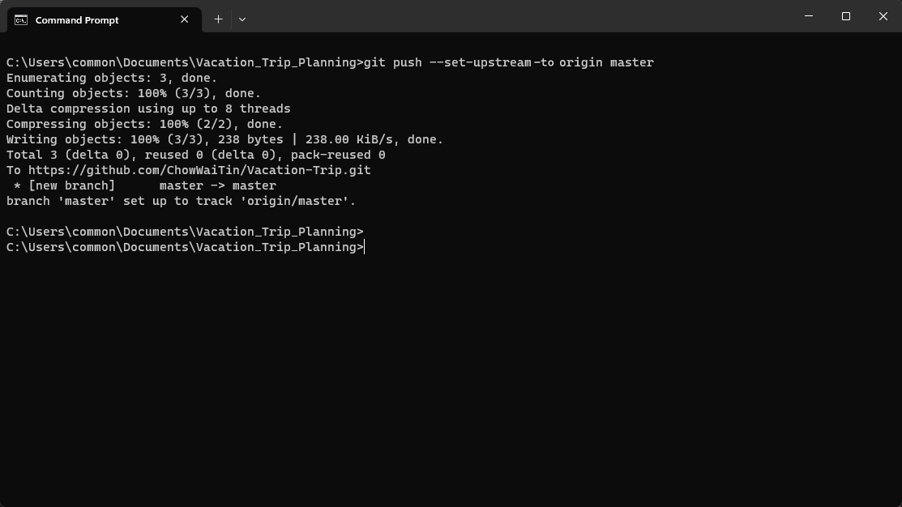

# Push Changes to Global Git Repository

## Purpose for Pushing Changes to Global Git Repository

Once you have connected your local repository to a global Git repository (often referred to as a remote repository), pushing changes from your local repository to the global repository serves several purposes:

1. Collaboration: 
    
    * Pushing your local changes to the global repository allows other team members or collaborators to access and integrate your changes into the shared codebase. It enables effective collaboration by making your updates available to the entire team.

2. Code Sharing and Distribution: 

    * Pushing changes to the global repository allows you to share your code with others beyond your immediate team. If you are working on an open-source project or sharing your code with a wider audience, pushing changes to the global repository makes them available for others to clone, review, and use.

3. Centralized Version Control: 

    * Pushing changes to the global repository helps maintain a centralized version control system. It ensures that the most up-to-date codebase and project history are accessible to everyone. It allows all team members to see the latest changes, track the progress of the project, and easily revert to previous versions if needed.

4. Backup and Redundancy: 

    * Pushing your changes to the global repository acts as a backup and ensures redundancy. If your local machine experiences any issues, such as hardware failure or data loss, your committed changes are safely stored in the global repository. You can retrieve your work from the global repository and continue working without losing progress.

5. Continuous Integration and Deployment (CI/CD): 

    * Pushing changes to the global repository can trigger automated CI/CD workflows. CI/CD tools can detect new commits and initiate processes like building, testing, and deploying the updated codebase. This facilitates automated testing, integration, and deployment pipelines, enabling faster and more reliable software delivery.

6. Remote Collaboration and Code Review: 

    * Pushing changes to the global repository allows for remote collaboration and code review. Team members or collaborators can review, comment on, and provide feedback on your changes. They can suggest improvements or identify issues before merging the changes into the main branch.

By pushing your local changes to the global repository, you make your work available to others, ensure version control, enable collaboration, and facilitate the overall development and maintenance of the project. It promotes transparency, efficient teamwork, and code stability across the project.

## Steps for Pushing Changes to Global Git Repository

1. To push your changes to the global repository, use the following Git Command in the Command Prompt:
```
git push --set-upstream origin <branch_name>
```
