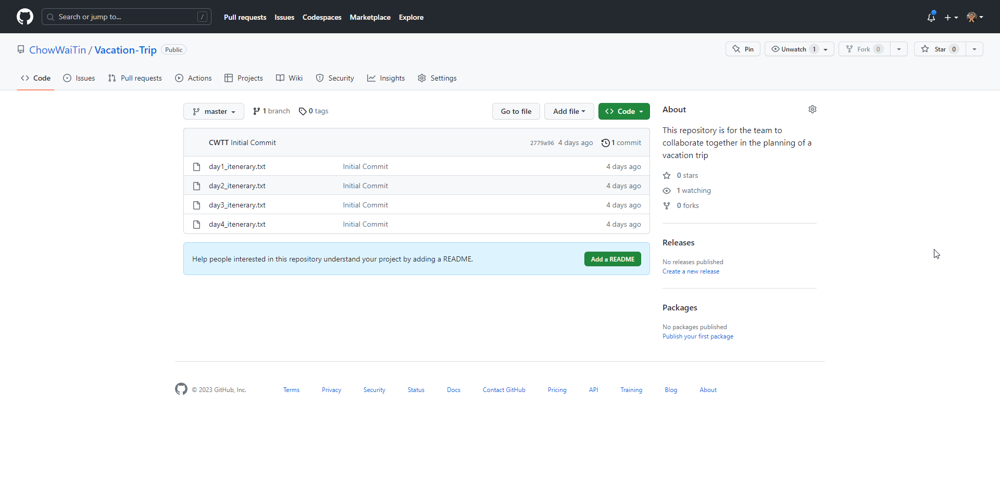
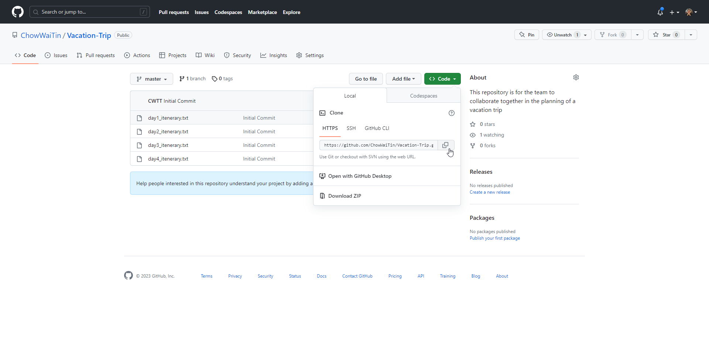
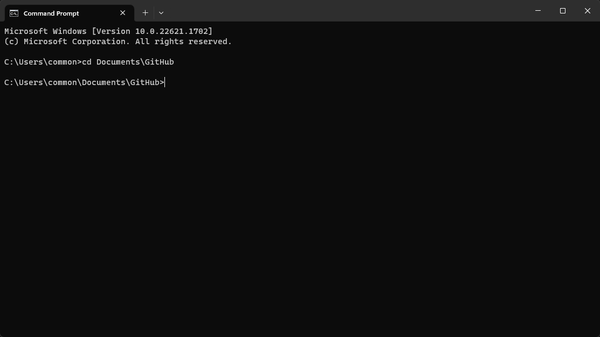
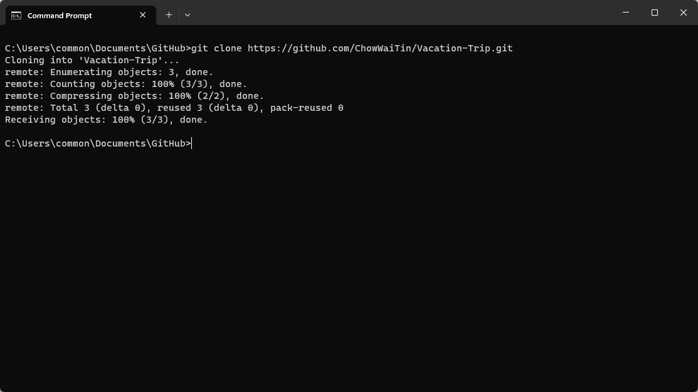

#  Getting Started - Begin Collaborating (Cloning Global Repository to Local Device)

## Purpose for Cloning Global Repository to Local Device

 When you clone a repository, you download all the files, commit history, branches, and other metadata associated with the repository. This local copy allows you to work with the codebase, make changes, and contribute to the project without directly modifying the original repository.

Cloning a Git repository offers several benefits:

1. Collaboration: 
    
    * By cloning a repository, you can contribute to a project by making changes to the code and proposing those changes to the repository's maintainers. Cloning allows you to work independently on your own copy and then push your changes back to the remote repository when you're ready.

2. Version control: 
    
    * Git provides powerful version control capabilities, and cloning allows you to have a complete history of all the commits and changes made to the repository. You can easily switch between different branches or versions, explore the commit history, and track changes over time.

3. Offline access: 

    * Once you clone a repository, you have a local copy on your machine. This means you can work on the project even when you're not connected to the internet. You can commit changes and create new branches without needing an active network connection.

4. Experimentation and testing: 
    
    * Cloning a repository allows you to experiment with the codebase freely. You can create new branches to try out new features, test bug fixes, or explore different approaches without affecting the original repository. If your experiments are successful, you can merge your changes back into the main branch.

5. Learning and studying: 

    * Cloning a repository is a common practice when you want to learn from or study an existing project. It gives you access to the complete source code, allowing you to analyze the implementation, understand the structure, and explore different components of the project.

Overall, cloning a Git repository provides a way to work with and contribute to a project while maintaining the integrity of the original codebase.
## Steps for Cloning Global Repository to Local Device

1. Ensure that you have *[Git installed](../1.%20Setting%20up%20the%20Pre-requisites/Download%20and%20Install%20Git%20Bash.md)* on your local device.

2. Find the Remote Repository URL: 

    * (i) Go to the remote repository you want to clone (e.g., on a hosting platform like GitHub or GitLab) 

        
    
    * (ii) Click on 

    * (iii) Under HTTPS, copy the URL of the remote repository by clicking on 

        

3. Navigate to the Desired Directory:

    * Using the Command Prompt, enter the following command in the command prompt:

        

4. Clone the Desired Remote Repository:

    * In this step, enter this git command in the command prompt:
        ```
        git clone <remote_repository_url>
        ``` 
        (The <remote_repository_url> is replaced with the url you have copied under Step 2 (iii))

    * Provide Credentials (if required):

        * If the repository is private or requires authentication, you might be prompted to enter your credentials (username and password, or a personal access token). Enter the required information to continue.

        * The prompt might look like this below:
        ```
        Cloning into 'example-repo'...
        Username for 'https://github.com': <enter your username>
        Password for 'https://username@github.com': <enter your password>
        ```
    
    * After using the git command, wait for the cloning process to be done and start collaborating on the project after it is done

        

You may return to [task.md](../TASKS.md#3-getting-started---begin-collaborating-cloning-global-repository-to-local-device)