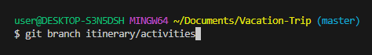
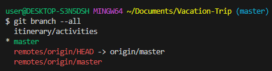
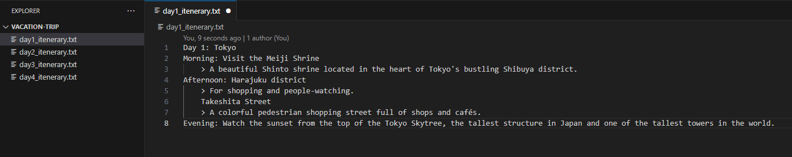
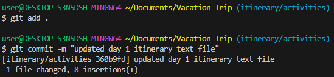
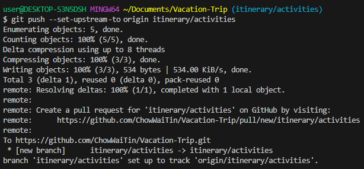
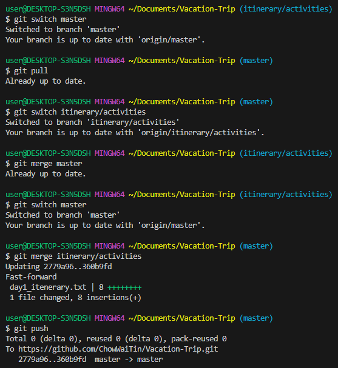
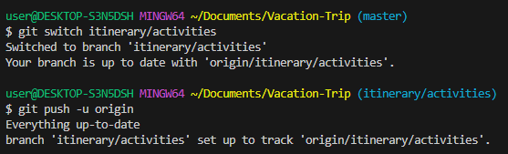

## Storyline 1 (Xun) 
1. Developer A is tasked to come up with the itinerary for Day 1.

    a. Firstly, he creates a branch name "`itinerary/activities`" with 
    ```
    git branch itinerary/activities.
    ```
    

2. Followed by switching to the branch he created. 
    ```
    git branch --all
    ```
    
    ```
    git switch itinerary/activities
    ```    
    

3. He starts to edit the text file named `day1_itinerary.txt` and then saved the file locally.

    

4. In order to share the changes with the group, he has to "push" the updates into the remote repository. After he is done editing the text file, he then stage, commit and push the files with the following:
    ```
    git add .
    git commit -m "updated day 1 itinerary text file"
    git push --set-upstream origin itinerary/activities
    ```
    
    

5. He then merged his branch to the main branch by checking for any changes in the main branch.
    ```
    git switch master    
    git pull
    git switch itinerary/activities
    git merge master
    git switch master
    git merge itinerary/activities
    git push
    ```
    

6. Lastly, he switches back to his own branch and published the branch along with his changes to the "`itinerary/activities`" remote repository.
    ```
    git switch itinerary/activities
    git push -u origin
    ```
    
    