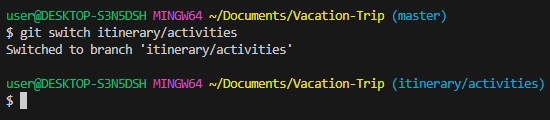
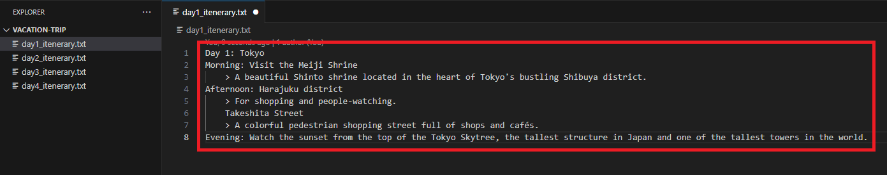

## Storyline 1 (Xun) 
1. Developer A is tasked to come up with the itinerary for day 1.

    a. Firstly, he creates a branch name "`itinerary/activities`" with 
    ```
    git branch itinerary/activities.
    ```
    

2. Followed by switching to the branch he created. 
    ```
    git branch --all
    ```
    
    ```
    git switch itinerary/activities
    ```    
    

3. He started to edit the text file named `day1_itenerary.txt` and saved the file locally.
    ```
    Day 1: Tokyo
    Morning: Visit the Meiji Shrine
        > A beautiful Shinto shrine located in the heart of Tokyo's bustling Shibuya district.
    Afternoon: Harajuku district 
        >For shopping and people-watching. 
        Takeshita Street
        >A colorful pedestrian shopping street full of shops and cafés.
    Evening: Watch the sunset from the top of the Tokyo Skytree, the tallest structure in Japan and one of the tallest towers in the world.
    ```
    

4. So in order to share the changes with the group, he has to "push" the updates into the remote repository. After he is done with editing of the text file, he staged, commit and push the files with the following:
    ```
    git add .
    git commit -m "updated day 1 itinerary text file"
    git push --set-upstream origin itinerary/activities
    ```
    
    

5. He then merge his branch to the main branch by checking for any changes in the main branch.
    ```
    git switch master    
    git pull
    git switch itinerary/activities
    git merge master
    git switch master
    git merge itinerary/activities
    git push
    ```
    

6. Lastly, he switches back to his own branch and publish the branch along with his changes to the "`itinerary/activities`" remote repository.
    ```
    git switch itinerary/activities
    git push -u origin
    ```
    
    