# Working on the same branch

## Pre-requisite
1. Complete the previous tasks.
2. Check that the files **day1.itinerary.txt** has been created in the initial file setup.

## Objective
1. Learn of possible merge conflict when working on the same file in the same branch
2. Understanding the different methods to handle merge conflict
3. Learn how to handle merge conflict (Accept both changes)


## Storyline 2
1. Developer A edits text file `day1_itinerary.txt` for Day 1 itinerary. While planning the schedule, he has difficulty choosing between one of the two places.

2. Developer B decides to help. He proceeded to clone the repository as instructed in 8._Clone_Repo.md.

3. After cloning, he proceeded to checkout Developer A's branch.

    a. Firstly, he list out the branches that have been created on the repository with the following command: 
    
    ```
    git branch --all
    ```
    
    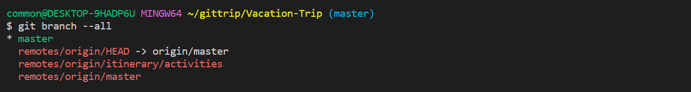

    b. Once he knows which branch Developer A is on, he uses either one of the following commands below to switch his current working branch to the same branch that Developer A is working on.
    
    ```
    git switch {Developer's A branch name} 
    ```
    
    ```
    git checkout {Developer's A branch name}
    ```

    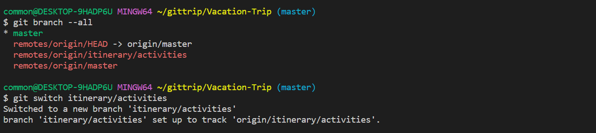
    
    A local branch is created from the remote branch. This can be seen by checking the branch with `git branch --all`

    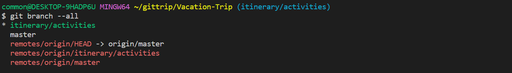

    - The **asterisk(*)** indicates the current branch.
    - The **white font color** indicates the local branch.  
    - The **red font color** indicates the remote branch.
    <br/>&nbsp;
    
4. Both of them ended up working in the same branch, on the same file.

5. Developer B began to work on the file. He decided to add an additional line into the afternoon plan and saved the file.
    
    ```
    Ramen Museum
    > Have fun looking at the different types of ramen out there
    ```

    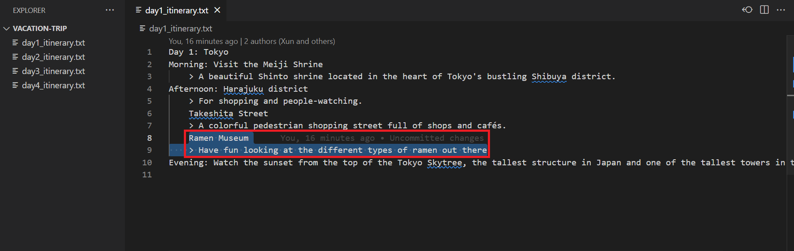


6. After finishing, Developer B commit the changes and pushes the edit.

    **a.** Firstly, he needs to pull the updates (if any) from the remote repository into his current working branch. This is to ensure that he gets the latest updates to the files in his branch locally. (In the event someone makes a commit and push into the remote branch)

    ```
    git pull
    ```

    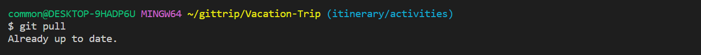

    This will fetch the latest updates from the remote repository and pull them into the local repository.

    In this case, there was no update to the remote repository since he last pulled.

    **b.** Next he can stage his changes and commit it after he is done with his work.
    ```
    git add .
    git commit -m "Updated day 1 itinerary"
    ```    

    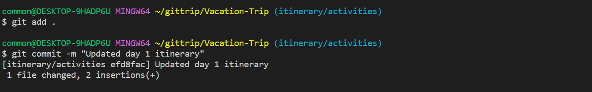

    -  `git add .` stages all the changes
    - `git commit -m <message>` creates a new commit with a message

    <br/>&nbsp;
    **c.** Lastly, he pushes his changes to the remote branch.

    ```
    git push
    ```

    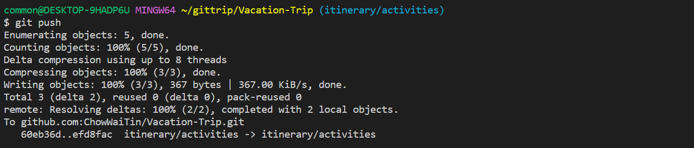

7. At the same time, Developer A made some changes to the file and tries to push the edit, not knowing Developer B had already made some changes.

    He made changes to the file.
    ```
    Tokyo Disneyland
    > Go and have fun!
    ```

    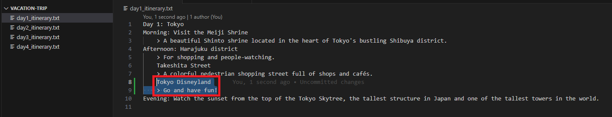


8. He staged his changes and commit with 

    ```
    git add .
    git commit -m "Made changes to day 1 itinerary"
    ```

    


9. Lastly, he tried to push the commits into the remote branch. However an error has occurred because there are new commit(s) in the remote repository that the local repository does not have.

    ```
    git push
    ```    

    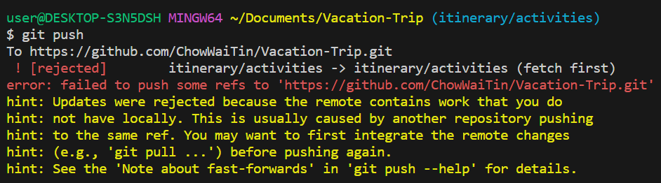

10. Developer A now has to fetch and pull the updates into the local repository before he can push his commit into the remote repository.

    ```
    git fetch
    git pull
    ```
    

11. This resulted in having a merge conflict and the file containing the conflict is opened for Developer A to view. Developer A can either edit and save the file manually or through the "`Resolve in Merge Editor`" button.

    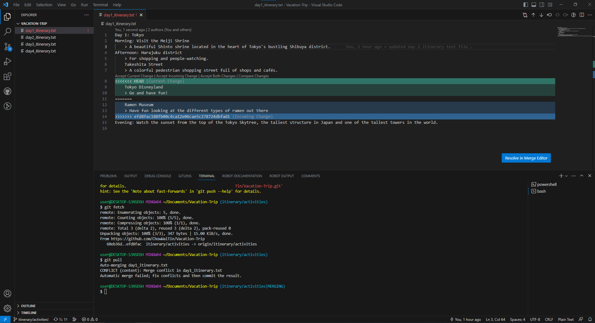

12. When approaching a merge conflict, it is necessary to study the files carefully and decide how to resolve it. There are 4 outcomes from a merge conflict:

    - Accept Developer B changes and discard Developer A changes
    - Accept Developer A changes and discard Developer B changes
    - Accept both changes
    - Accept a mixture of changes of Developer A and Developer B


13. In the case of Developer A, he felt that both his and Developer B's work are required and decided to **accept both changes**. 

    Hence, he has to be careful that Developer B's work does not overwrite his own work and vice versa. 
    
    Below are two ways Developer A can take to resolve the conflict:

    a. He can edit the file manually by carefully look through the lines that has conflict and delete/edit the conflicted lines in the file.

    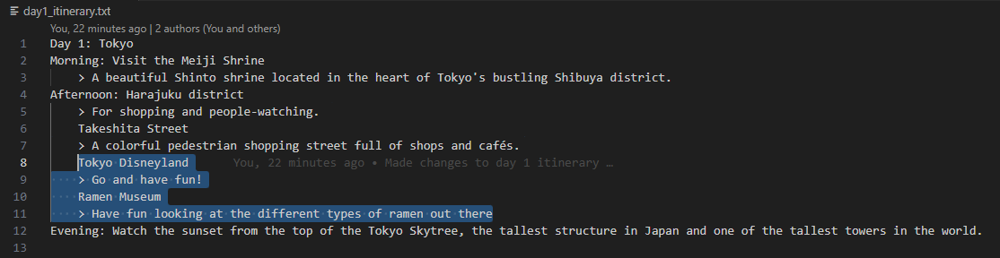

    b. 
    - Resolve the conflict through the "`Resolve in Merge Editor`" button.

    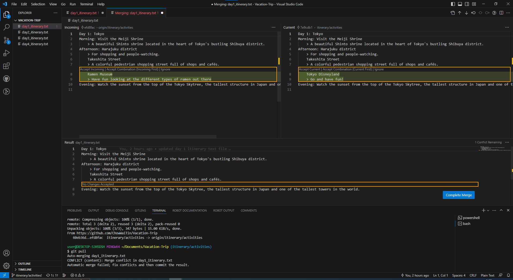

    - Selecting which changes to accept (Current or Incoming changes).
    Which in this case, Developer A decides to accept and keep both changes.

    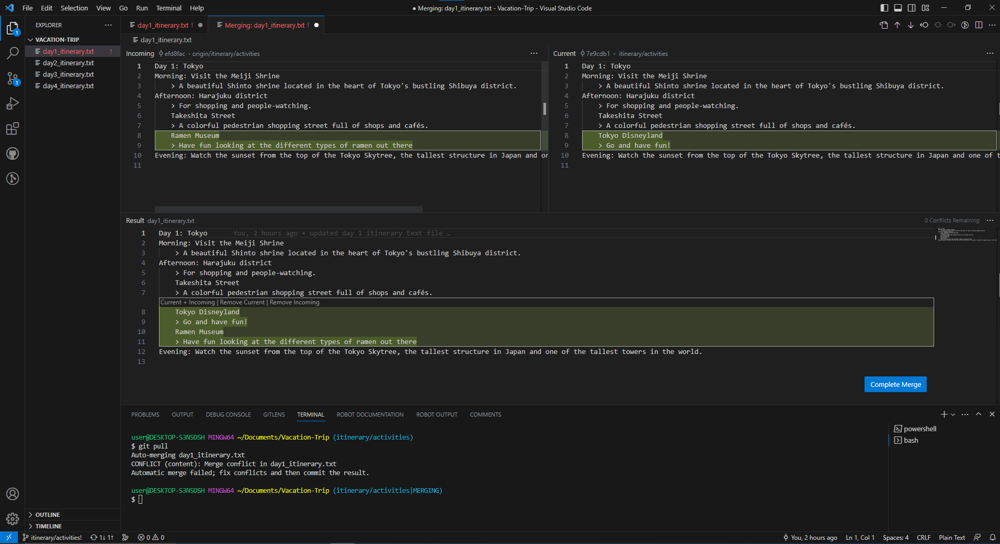

14. Once done, Developer A can click on the "`Complete Merge`" button. Developer A can now proceed to commit and push the changes to his own remote repository.
    ```
    git add .
    git commit -m "Resolve merge conflict"
    git push
    ```

    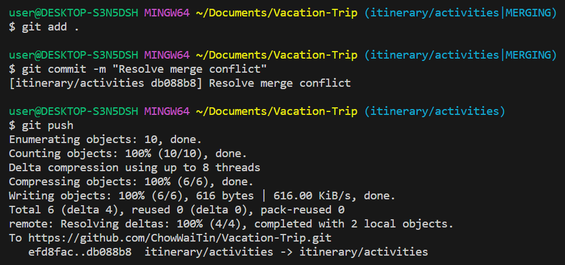

## Lesson Learnt
1. Recap basic flow of staging changes, committing the change, pulling updates to local repo, pushing updates to remote repo.

2. Potential conflicts arising when updating the local repo from the remote repo.

3. Handling of merge conflict 

You may return [here](../../README.md#storyline-2)