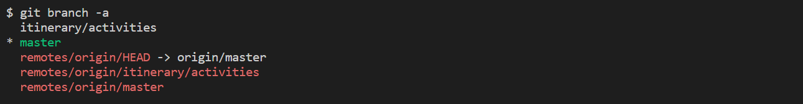
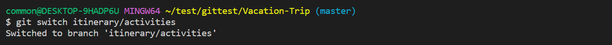
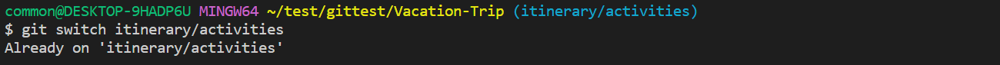
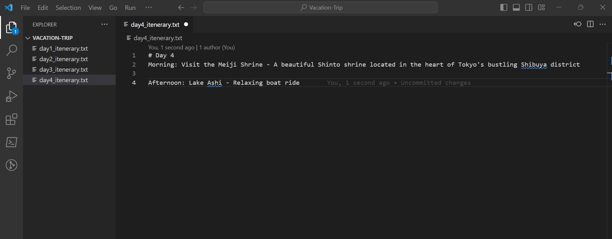
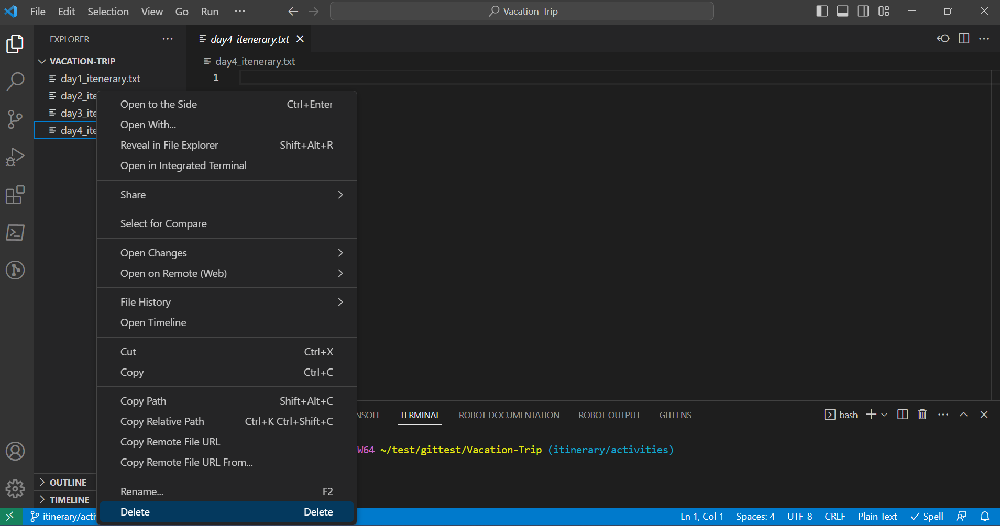

# Editing and Deleting File the Same File

## Pre-requisite
1. Complete the previous tasks.
2. Check that the files **day4_itinerary.txt** has been created in the initial file setup.

## Objective
1. Learn of possible merge conflict from deleting files
2. Handling of merge conflict

## Storyline 3 (Bao Jin)
1. Developer A and B continues to work on the itinerary. Both of them worked within the itinerary/activities branch. Developer A found a number of interesting activities and decided to add them to their day 4 plan in the **day4_itinerary.txt** file

    - Developer A checks the branches with `git branch -a`.
        ```ps1
        # Check all branch
        git branch -a
        ```
        This will show all the branch (local and remote). The command is the same as the `git branch --all` used previously.
        
        Look for the local branch "`itinerary/activities`" branch. 
        
        

        If branch is missing, please ensure that the previous task has been completed.

    - Developer A switch to the "`itinerary/activities`" branch.
        ```ps1
        # Switching branch
        git switch itinerary/activities
        ```
        If switching from another branch:
        
        
        If already on current branch:
        
        
    - Developer A added modifications to the **day4_itinerary.txt** and saved it.
        ```
        # Day 4
        Morning: Visit the Meiji Shrine - A beautiful Shinto shrine located in the heart of Tokyo's bustling Shibuya district

        Afternoon: Lake Ashi - Relaxing boat ride 
        ```
        

2. Meanwhile, Developer B has learnt that the trip had to be cut short because of a change in their leave plan. Instead of the 4 days trip, the trip was cut short to 3 days. He decided to delete the the **day4_itinerary.txt** file. This change, however, was not made aware to Developer A.

    - Developer B checks the branches with `git branch -a`.
        ```ps1
        # Check all branch
        git branch -a
        ```
        (Refer to previous step for more details)

        

        If branch is missing, please ensure that the previous task has been completed.

    - Developer B switch to the "`itinerary/activities`" branch
        ```ps1
        # Switching branch
        git switch itinerary/activities
        ```
        


3. After completing the update on the **day4_itinerary.txt** file, Developer A staged his changes, made a commit and pushed the changes to the remote repository.

    - Developer A stage changes with `git add .`
        ```ps1
        git add .
        ```
    - Developer A commits with `git commit -m <comment>`
        ```ps1
        git commit -m "Added new activities to activities.txt"
        ```
    - Developer A pull changes with `git pull origin`
        ```ps1
        # fetch the latest changes
        git fetch origin
        # pull latest changes from repository
        git pull origin
        ```
    - Developer A push changes with `git push origin`
        ```ps1
        # push the update
        git push origin
        ```

4. At the same time, Developer B deleted **day4_itinerary.txt** file. He staged his changes and made a commit. Before pushing his changes to the remote repository, he updated his local repository and found a conflict.

    - Developer B deletes the **day4_itinerary.txt**
        

    - Developer B stage changes with `git add .`
        ```
        git add .
        ```
    - Developer B commits with `git commit -m <comment>`
        ```
        git commit -m "Transfer activities info to itinerary.txt. Delete activities.txt."
        ```
    - Update local repository with remote repository with `git pull origin`
        ```ps1
        # fetch the latest changes
        git fetch origin
        # pull latest changes from repository
        git pull origin
        ```
    - Upon pulling the remote repository, Developer B encountered merge conflict from the deleted file.

5. Developer B subsequently proceeded to resolve the conflict

    - Open the project folder in **Visual Studio Code**.
    - Transfer new changes to the **day3_itinerary.txt** instead of **day4_itinerary.txt**
    - Delete **day4_itinerary.txt**
    - Perform a commit with `git commit -m <comment>`
        ```
        git commit -m "Resolve conflict from deleted activities.txt"
        ```

6. Developer B pushed his changes to the remote repository and proceed to inform Developer A of this change.
    
    - Developer B pushes the changes to remote repository with `git push origin`
        ```
        git push origin
        ```


## Lesson Learn
1. Potential conflicts from file deletion and how to handle it.

2. Importance of communication as a team.

3. Fetch and pull changes from remote repository before pushing changes.