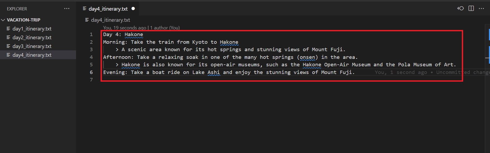
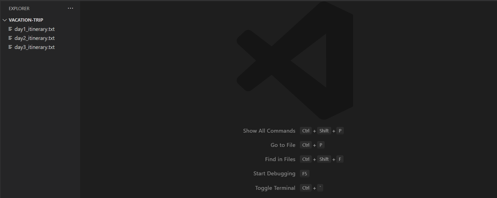
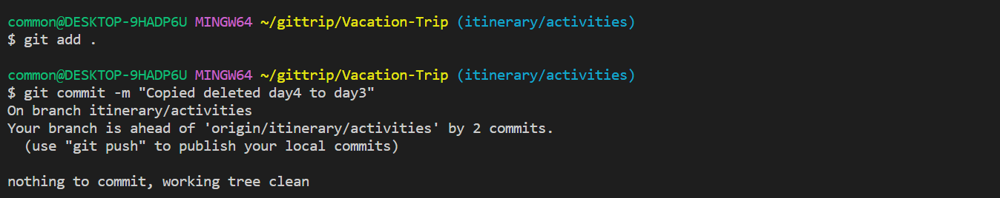

# Editing and Deleting File the Same File

## Pre-requisite
1. Complete the previous tasks.
2. Check that the files **day4_itinerary.txt** has been created in the initial file setup.
3. Check that the branch `itinerary/activities` has been created.

## Objective
1. Learn of possible merge conflict from deleting files
2. Learn how to handle merge conflict (Accept one change)
3. Revise basic git commands and git flow.

## Storyline 3
1. Developer A continues to work on the itinerary. Both of them worked within the itinerary/activities branch. 

    - Developer A checks the branches with `git branch -a`
        ```
        git branch -a
        ```
        This will show all the branch (local and remote). The command is the same as the `git branch --all` used previously.
        
        Check that the current local branch is "`itinerary/activities`" branch. The asterisk(*) indicates the branch.
        
        

        If the branch is missing, please ensure that the previous task has been completed.

    - If current branch is at "`master`", switch to the "`itinerary/activities`" branch.
        ```
        git switch itinerary/activities
        ```
        If switching from another branch:
        
        
        If already on current branch:
        

    - Developer A updates the branch using `git pull`
        ```
        git pull
        ```

        If there are no updates , the response will be `Already up to date`.

        


2. Developer B has learnt that the trip had to be cut short because of a change in their leave plan. Instead of the 4 days trip, the trip was cut short to 3 days. He decided to delete the  **day4_itinerary.txt** file, which he found to be empty. This change, however, was not made aware to Developer A.

    - Developer B checks the branches with `git branch -a`
        ```
        git branch -a
        ```

        Check that the current local branch is "`itinerary/activities`" branch. The asterisk(*) indicates the branch.
        
        

    - If current branch is at "`master`", switch to the "`itinerary/activities`" branch.
        ```
        git switch itinerary/activities
        ```
        If switching from another branch:
        
        
        If already on current branch:
        

    - Developer B updates the branch using `git pull`
        ```
        git pull
        ```

        If there are updates , the response will display the updating.

        


3. Meanwhile, Developer A found a number of interesting activities. He found it to be suitable for their day 4 plan and added them in the **day4_itinerary.txt** file, which was empty.

    - Developer A added modifications to the **day4_itinerary.txt** and saved it. The changes are highlighted in red.
        ```
        Day 4: Hakone
        Morning: Take the train from Kyoto to Hakone
            > A scenic area known for its hot springs and stunning views of Mount Fuji.
        Afternoon: Take a relaxing soak in one of the many hot springs (onsen) in the area.
            > Hakone is also known for its open-air museums, such as the Hakone Open-Air Museum and the Pola Museum of Art.
        Evening: Take a boat ride on Lake Ashi and enjoy the stunning views of Mount Fuji.
        ```
        

4. After completing the update on the **day4_itinerary.txt** file, Developer A staged his changes, made a commit and pushed the changes to the remote repository.

    - Developer A stage changes with `git add .`
        ```
        git add .
        ```
    - Developer A commits with `git commit -m <comment>`
        ```
        git commit -m "Added new activities to day4_itinerary.txt"
        ```
    - Developer A pull changes with `git pull origin`
        ```ps1
        # fetch the latest changes
        git fetch origin
        # pull latest changes from repository
        git pull origin
        ```
    - Developer A push changes with `git push origin`
        ```
        git push origin
        ```

    

    >**NOTE:** By default, `git pull` will call `git pull origin`, with `origin` referring to the remote repository. 

5. At the same time, Developer B deleted **day4_itinerary.txt** file. He staged his changes and made a commit. Before pushing his changes to the remote repository, he updated his local repository and found a conflict.

    - Developer B deletes the **day4_itinerary.txt**
        

        

    - Developer B stage changes with `git add .`
        ```
        git add .
        ```
    - Developer B commits with `git commit -m <comment>`
        ```
        git commit -m "Trip cut short. Deleted day4_itinerary.txt"
        ```
        
    - Update local repository with remote repository with `git pull origin`
        ```
        git pull origin
        ```
        Upon pulling the remote repository, Developer B encountered merge conflict from the deleted file.
        


6. Developer B subsequently proceeded to resolve the conflict

    - Open the project folder in **Visual Studio Code**.
    
    

    - Open the source control 

    

    In this scenario, the **day4_itinerary.txt** file needs to be deleted. Hence, Developer B changes will be accepted. 

    There are 2 methods to perform this:

    a. Using the source control in visual studio code

    - Right-click on the **day4_itinerary.txt** under the source control and click **Stage Changes**
    

    - In the pop-up window, select **Delete File**
    

    - Add comment
    ```
    git commit -m "Resolve conflict from deleted activities.txt"
    ```
    - Click Sync Changes
    

    - Click on the **OK** button when prompted to pull and push commits.
    


    b. **Alternative:** Deleting manually, stage changes and perform commit.

    - Delete **day4_itinerary.txt**
    

    - Stage the changes 
        ```
        git add .
        ```
    - Perform a commit with `git commit -m <comment>`
        ```
        git commit -m "Resolve conflict from deleted activities.txt"
        ```
        

7. Developer B subsequently decided to transfer the new changes to the **day3_itinerary.txt**, which was empty.

    - Added new changes to **day3_itinerary.txt**
        ```
        Day 3: Hakone
        Morning: Take the train from Kyoto to Hakone
            > A scenic area known for its hot springs and stunning views of Mount Fuji.
        Afternoon: Take a relaxing soak in one of the many hot springs (onsen) in the area.
            > Hakone is also known for its open-air museums, such as the Hakone Open-Air Museum and the Pola Museum of Art.
        Evening: Take a boat ride on Lake Ashi and enjoy the stunning views of Mount Fuji.
        ```

        

    - Stage changes and commit
        ```
        git add .
        git commit -m "Copied deleted day4 to day3"
        ```

        

8. Developer B pushed his changes to the remote repository and proceed to inform Developer A of this change.
    
    - Developer B pushes the changes to remote repository with `git push origin`
    ```
    git push origin
    ```

    


## Lesson Learn
1. Recap basic flow of staging changes, committing the change, pulling updates to local repo, pushing updates to remote repo.

2. Recap need to fetch and pull changes from remote repository before pushing changes.

3. Potential conflicts from file deletion.

4. Handling of merge conflict

You may return [here](../../README.md#storyline-3)
