# Merging Different Branches

## Pre-requisite
1. Complete the previous tasks.
2. Check that the files **day3.itinerary.txt** has been created in the initial file setup.

## Objective
1. Learn of possible merge conflict from merging different branches.
2. Handling of merge conflict
3. Understanding the different ways to handle merge conflict


## Storyline 4 (Bao Jin)
1. Developer A and B decided to begin planning for their food on day 3 in **day3_itinerary.txt** by listing the different food outlets available. They decided that they did not want to mix their food planning with their itinerary planning. 

2. Developer A decided to create another branch from the `itinerary/activities` branch.

    **Developer A switch to `itinerary/activities` and pull changes**
    - Check the current branch location with `git branch`
        ```
        git branch
        ```
        The command displays the **local branches** in the **local repository**. The branch name with the asterisk(*) is the current branch location.

        

    - If the current branch is not `itinerary/activities`, switch to main branch with `git switch <branch>`
        ```
        git switch itinerary/activities
        ```
        If branch switch is successful, the prompt `switched to branch` will appear. 
        

        To confirm the current branch, repeat the `git branch` command. The asterisk(*) should be beside the `itinerary/activities` branch.
        

    - Ensure `itinerary/activities` branch is updated with `git pull`
        ```
        git fetch
        git pull
        ```

    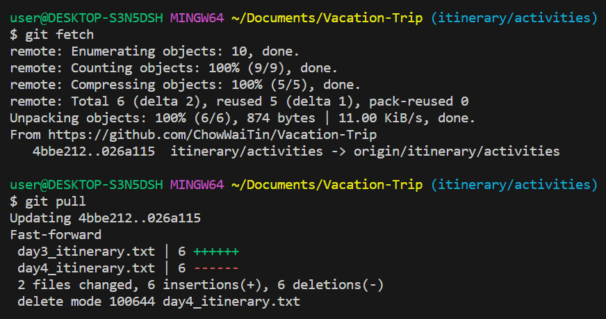

    **Developer A creates a new branch**
    - Create a new branch and navigate to the branch "`itinerary/food`"
        ```
        git checkout -b itinerary/food
        ```

        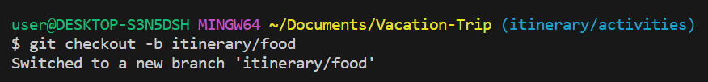

        The `git checkout -b <new_branch_name>` command can be thought of as a combination of `git branch <new_branch_name>` and `git switch <new_branch_name>`.

        
    - Check the current branch location with `git branch`
        ```
        git branch
        ```
        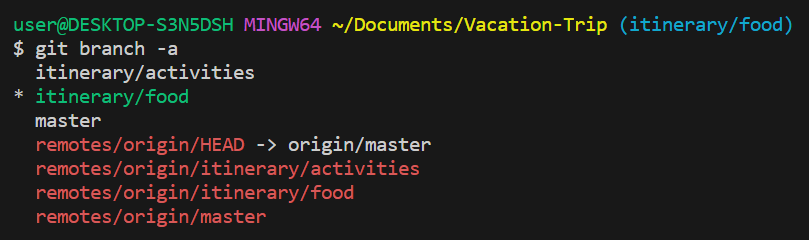

    - Publish branch in the remote repository in order to share with other developers. This will create a new remote branch.
        ```
        git push -u origin itinerary/food
        ```

        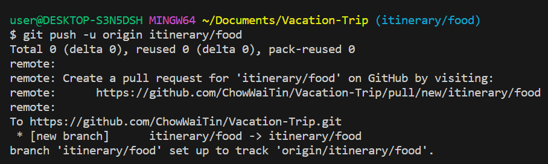

3. Developer B decided to work independently from Developer A. In order to achieve this, he decided to create another branch out of the itinerary/activities branch.

    **Developer B switch to `itinerary/activities` and pull changes**
    - Developer B checks the branches with `git branch -a`.
        ```
        git branch -a
        ```

        Check that the current local branch is "`itinerary/activities`" branch. The asterisk(*) indicates the branch.
        
        

    - If current branch is at "`master`", switch to the "`itinerary/activities`" branch
        ```
        git switch itinerary/activities
        ```
        If switching from another branch:
        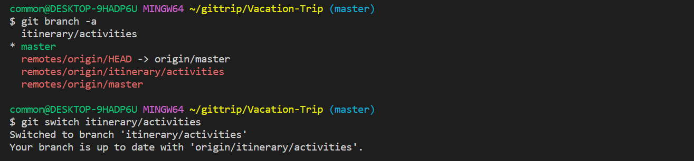
        
        If already on current branch:
        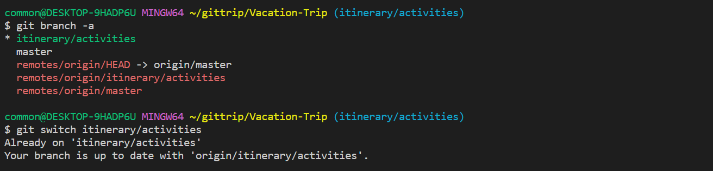

    - Developer B updates the branch using `git pull`
        ```
        git fetch
        git pull
        ```
        If there are no updates in the remote repository, there will be a prompt indicating that the local repository is already up to date.
        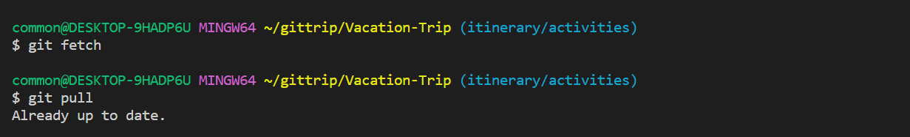

    **Developer B creates a new branch**
    - Developer B creates a new branch and switch to it `git checkout -b <new_branch_name>`
        ```
        git checkout -b itinerary/delicacy
        ```
        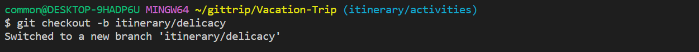

    - Publish branch to remote repository with `git push -u origin <new_remote_branch_name>`
        ```
        git push -u origin itinerary/delicacy
        ```
        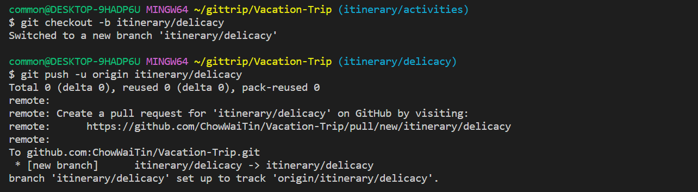

4. Developer B obtained a list of food outlets using the internet. After searching for the required information, he decided to update the **day3_itinerary.txt** file.

    - Developer B update the file **day3_itinerary.txt** to include the food plan and proceeded to save.
        ```
        Day 3: Hakone
        ** Have breakfast before proceeding
        Morning: Take the train from Kyoto to Hakone
            > A scenic area known for its hot springs and stunning views of Mount Fuji.
        Afternoon: Take a relaxing soak in one of the many hot springs (onsen) in the area.
            > Hakone is also known for its open-air museums, such as the Hakone Open-Air Museum and the Pola Museum of Art.
        Evening: Take a boat ride on Lake Ashi and enjoy the stunning views of Mount Fuji.
                
        # Food Plan
        Morning:
            > LOCATION: Gion Tokuya
        Afternoon:
            > LOCATION: Hakone Soba Okamotoya
        Evening:
            > LOCATION: TBD
        ```
        Changes made are highlighted.
        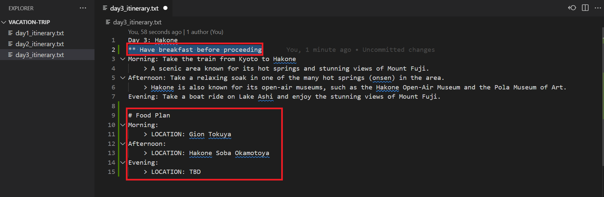

        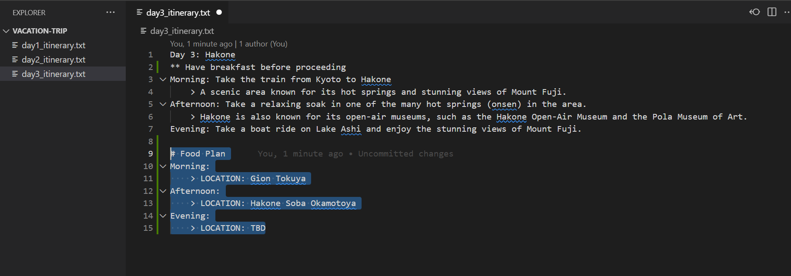

5. After adding his update, Developer B decided to stage his changes, make a commit and push his changes to his remote branch `itinerary/delicacy`.

    - Stage change with `git add .`
        ```
        git add .
        ```
        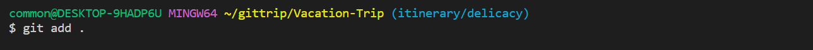

    - Commit changes with `git commit -m <commit_message>`
        ```
        git commit -m "Added places to eat on day 3"
        ```
        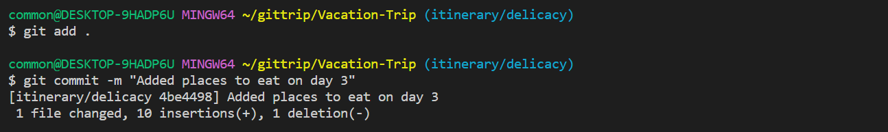

    - Pull any changes in remote repository with `git pull`
        ```
        git pull
        ```
        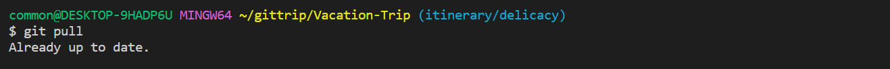
    
    - Update remote repository with `git push`
        ```
        git push
        ```
        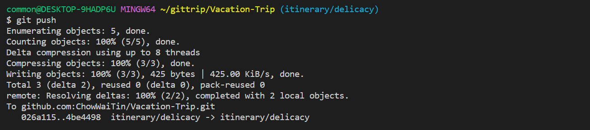

6. While Developer B was creating a list of food outlets, Developer A was also working on a similar task. However, he chose to research the list through guide books and other source. Upon completion of his research, he decided to update the **day3_itinerary.txt** file in his `itinerary/food` branch.

    - Developer A update the file: **day3_itinerary.txt**
        ```
        Day 3: Hakone
        Morning: Take the train from Kyoto to Hakone
        ** Have breakfast after train ride
            > A scenic area known for its hot springs and stunning views of Mount Fuji.
        Afternoon: Take a relaxing soak in one of the many hot springs (onsen) in the area.
            > Hakone is also known for its open-air museums, such as the Hakone Open-Air Museum and the Pola Museum of Art.
        Evening: Take a boat ride on Lake Ashi and enjoy the stunning views of Mount Fuji.
                
        # Food Plan
        Breakfast:
            > LOCATION: Tenzan
        Lunch:
            > LOCATION: Kaiseki Kotone
        Dinner:
            > LOCATION: Hakone Soba Okamotoya
        ```

7. Upon completion of his task, Developer A decided to stage his changes, make a commit. He subsequently pushed his changes to the `itinerary/food` branch

    - Stage change with `git add .`
        ```
        git add .
        ```
    - Commit changes with `git commit -m <commit_message>`
        ```
        git commit -m "Added a list of food outlet for day 3"
        ```

        

    - Update remote repository with `git push origin`
        ```ps1
        # Check for updates
        git pull origin
        # Push his changes
        git push origin
        ```
        

8. After having updated the remote repository with his list, Developer A saw a message from Developer B indicating that the latter has updated a list of his own in a separate branch. He decided to consolidate the information in order to create a complete list.


9. Developer A begins by finding and navigating to the branch created by Developer B to see the changes.
    - Pull any updates from remote branch
        ```
        git pull
        ```

    - Find the remote branch `itinerary/delicacy` created by Developer B
        ```
        git branch -a
        ```

        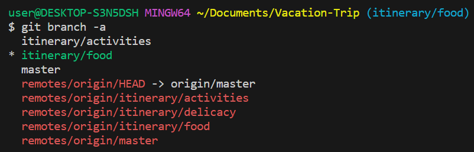
        
    - Switch to remote branch `itinerary/delicacy`
        ```
        git switch itinerary/delicacy
        ```

        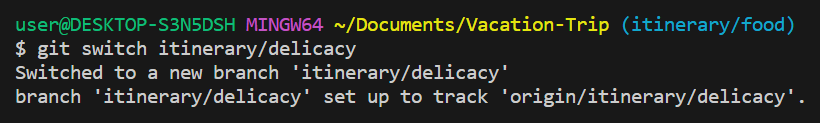

10. Developer A subsequently decides to merge Developer B's branch to his own. 
    - Switch to his `itinerary/food` branch
        ```
        git switch itinerary/food
        ```
        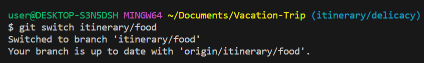

    - Merge the "`itinerary/delicacy`" into the current branch "`itinerary/food`"
        ```
        git merge itinerary/delicacy
        ```
        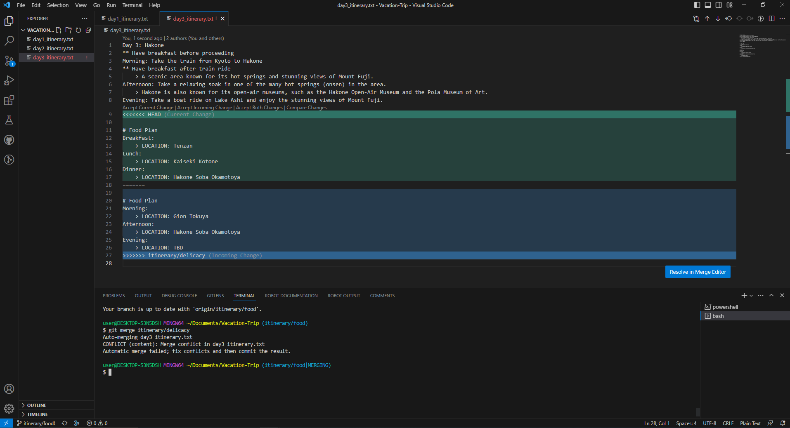

11. Upon merging, Developer A encountered conflict as they had updated the same file. He proceeds to begin the conflict resolution. While resolving the conflict, Developer A found that there are merits in both his and Developer B's idea. He proceeded to adopt some changes from both sides.

    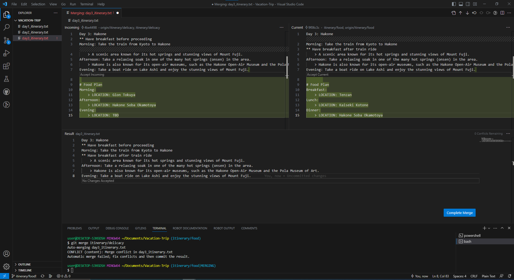

    - Accept changes from both sides.

    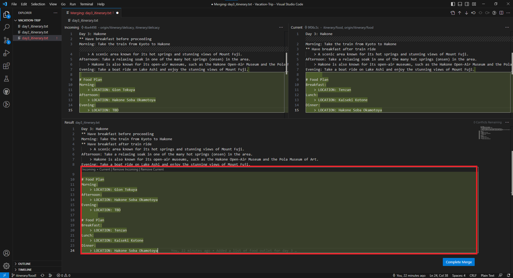

    - Perform manual changes to include info from both sides

    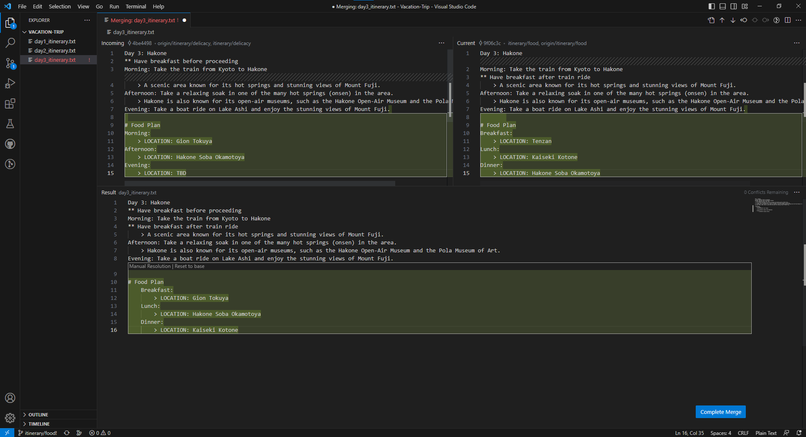
    

    ```
        # Food Plan
        Breakfast:
            > LOCATION: Gion Tokuya
        Lunch:
            > LOCATION: Hakone Soba Okamotoya
        Dinner:
            > LOCATION: Kaiseki Kotone
    ```

    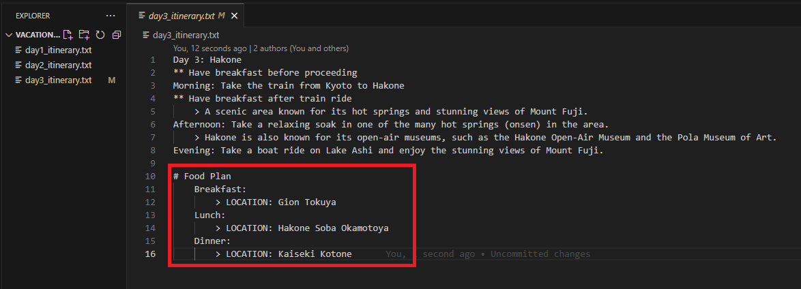

12. After resolving all the changes, Developer A created a commit to finalize the merge. The result of the merge is in food/location branch.

    - Stage change with `git add .`
        ```
        git add .
        ```
    - Commit changes with `git commit -m <commit_message>`
        ```
        git commit -m "Resolved merge for day 3 itinerary."
        ```        
    - Commit changes with `git push`
        ```
        git push
        ```        

    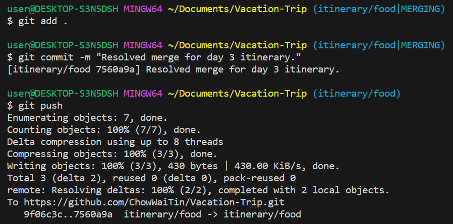

13. Developer B was subsequently informed of the changes. He went on the review the changes in the `itinerary/food` branch.

    - Pull all changes from the remote repository
        ```
        git pull
        ```

    - Checks the branch present
        ```
        git branch -a
        ```

    - Switch to the `itinerary/food` branch
        ```
        git switch itinerary/food
        ```
        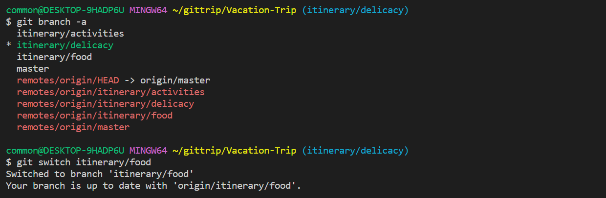

14. Developer B opened up the **day3_itinerary.txt** file using VS code and began reviewing it. In the process, he found that there was some error that was not picked up.

    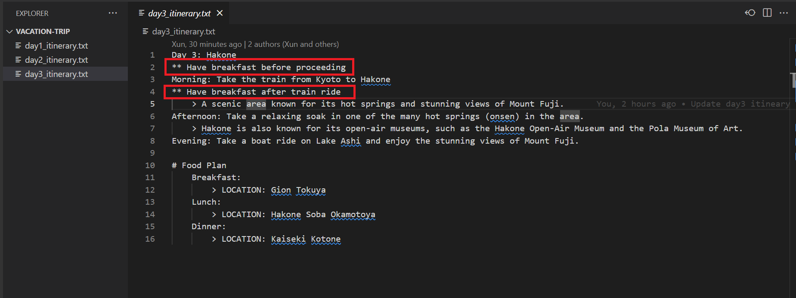

    There was no indication in the merge conflict as both Developer A and Developer B has made changes in 2 separate lines. The auto resolution done during the `git merge` accepted both lines as there was no conflict. 
    
    Even though there was no conflict in that section, the result of the auto merge may not be the desired result.

15. Developer B proceeded to remove the bottom line and updated the remote repository

    - Update file **day3_itinerary.txt** and save.

        ```
        Day 3: Hakone
        ** Have breakfast before proceeding
        Morning: Take the train from Kyoto to Hakone
            > A scenic area known for its hot springs and stunning views of Mount Fuji.
        Afternoon: Take a relaxing soak in one of the many hot springs (onsen) in the area.
            > Hakone is also known for its open-air museums, such as the Hakone Open-Air Museum and the Pola Museum of Art.
        Evening: Take a boat ride on Lake Ashi and enjoy the stunning views of Mount Fuji.

        # Food Plan
        Breakfast:
            > LOCATION: Gion Tokuya
        Lunch:
            > LOCATION: Hakone Soba Okamotoya
        Dinner:
            > LOCATION: Kaiseki Kotone

        ```
        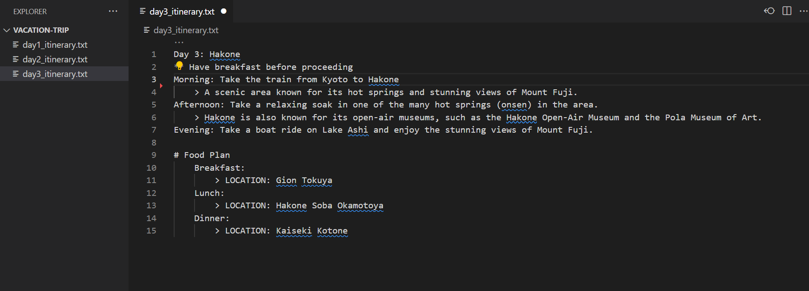

    - Stage changes, perform commit 
        ```
        git add .
        git commit -m "Reviewed day 3 plan and remove extra line"
        ```

        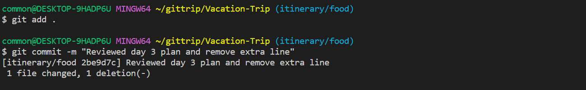

    - Update remote repository `itinerary/food`
        ```
        git pull
        git push
        ```
        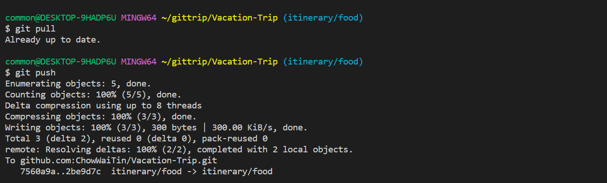


## Lesson Learnt
1. Recap branch creation and publishing branch to remote repository

2. Recap basic flow of any updates

3. Understand branch merger

4. Understand conflicts during branch merger

5. Understand manual conflict resolution

6. Understand that changes to different lines in the same file will not lead to merge conflict.

