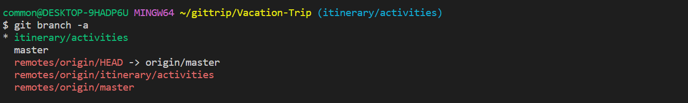

# Merging Different Branches

## Pre-requisite
1. Complete the previous tasks.
2. Check that the files **day3.itinerary.txt** has been created in the initial file setup.

## Objective
1. Learn of possible merge conflict from merging different branches.
2. Handling of merge conflict
3. Understanding the different ways to handle merge conflict


## Storyline 4 (Bao Jin)
1. Developer A and B decided to begin planning for their food on day 1 in **day1_itinerary.txt** by listing the different food outlets available. They decided that they did not want to mix their food planning with their literary planning. 

2. Developer A decided to create another branch from the `itinerary/activities` branch.


    Developer A created a new branch as follows:
    - Check the current branch location with `git branch`
        ```
        git branch
        ```
        The command displays the **local branches** in the **local repository**. The branch name with the asterisk(*) is the current branch location.

        

    - If the current branch is not `itinerary/activities`, switch to main branch with `git switch <branch>`
        ```
        git switch itinerary/activities
        ```
        If branch switch is successful, the prompt `switched to branch` will appear. 
        

        To confirm the current branch, repeat the `git branch` command. The asterisk(*) should be beside the `itinerary/activities` branch.
        

    - Ensure `itinerary/activities` branch is updated with `git pull origin`
        ```
        git fetch origin
        git pull origin
        ```
    - Create a new branch and navigate to the branch "`itinerary/food`"
        ```
        git checkout -b itinerary/food
        ```
        The `git checkout -b <new_branch_name>` command can be thought of as a combination of `git branch <new_branch_name>` and `git switch <new_branch_name>`.

    - Check the current branch location with `git branch`
        ```
        git branch
        ```
    - Publish branch in the remote repository in order to share with other developers. This will create a new remote branch.
        ```
        git push -u origin food/locations
        ```

2. Developer B decided to work independently from Developer A. In order to achieve this, he decided to create another branch out of the itinerary/activities branch.

    - Developer B checks the branches with `git branch -a`.
        ```
        git branch -a
        ```

        Check that the current local branch is "`itinerary/activities`" branch. The asterisk(*) indicates the branch.
        
        

    - If current branch is at "`master`", switch to the "`itinerary/activities`" branch
        ```
        git switch itinerary/activities
        ```
        If switching from another branch:
        
        
        If already on current branch:
        

    - Developer B updates the branch using `git pull`
        ```
        git pull
        ```
    - Developer B creates a new branch and switch to it `git checkout -b <new_branch_name>`
        ```
        git checkout -b itinerary/delicacy
        ```
    - Publish branch to remote repository with `git push -u origin <new_remote_branch_name>`
        ```
        git push -u origin itinerary/delicacy
        ```

3. Developer B obtained a list of food outlets using the internet. After searching for the required information, he decided to update the **day3_itinerary.txt** file.

    - Developer B update the file: **day3_itinerary.txt**
        ```
        <Other data omitted> 

        # Food Outlets
        Meiji Shrine area: Kagari Ramen, Harajuku Gyoza Lou, or Gyukatsu Motomura
        Tokyo Skytree: Sky Restaurant 634, Sumida Aquarium Café & Restaurant, or Soranoiro Nippon            
        ```

4. Upon completion of his task, Developer B decided to stage his changes, make a commit. He subsequently push his changes to his remote branch `itinerary/delicacy` as his task was completed

    - Stage change with `git add .`
        ```
        git add .
        ```
    - Commit changes with `git commit -m <commit_message>`
        ```
        git commit -m "Added a list of food outlets"
        ```
    - Update remote repository with `git push origin`
        ```ps1
        # Check for updates
        git pull origin
        # Push his changes
        git push origin
        ```

5. While Developer B was creating a list of food outlets, Developer A was also working on a similar task. However, he chose to research the list through guide books and took a little longer to complete his list. Upon completion of his research, he decided to update the **day3_itinerary.txt** file.

    - Developer A update the file: **day3_itinerary.txt**
        ```
        <Other data omitted> 

        # Food Plan
        Fushimi Inari Shrine: Udon Yamaokaya, Inari No Chanya, or Sushi Mamire
        Gion district: Gion Kappa, Gion Nanba, or Gion Tokuya 
        ```

6. Upon completion of his task, Developer A decided to stage his changes, make a commit. He subsequently pushed his changes to the `itinerary/food` branch

    - Stage change with `git add .`
        ```
        git add .
        ```
    - Commit changes with `git commit -m <commit_message>`
        ```
        git commit -m "Added a list of food outlets"
        ```
    - Update remote repository with `git push origin`
        ```ps1
        # Check for updates
        git pull origin
        # Push his changes
        git push origin
        ```

7. After having updated the remote repository with his list, Developer A saw a message from Developer B indicating that the latter has updated a list of his own in a separate branch. He decided to merge the information in order to create a complete list.

    - Pull newly created remote branch using `git pull <remote_name>  <remote_branch_name>:<new_local_branch_name>`
        ```ps1
        # This creates a local branch from the remote branch
        git pull origin itinerary/delicacy:itinerary/delicacy
        ```

    - Switch to his `itinerary/food` branch
        ```
        git switch itinerary/food
        ```
    - Merge the "`itinerary/delicacy`" into the current branch "`itinerary/food`"
        ```
        git merge itinerary/delicacy
        ```

8. Upon merging, Developer A encountered conflict as they had updated the same file. He proceed to begin the conflict resolution 
    - Open **Visual Studio Code**


9. When resolving the conflict, Developer A found that there are merits in both his and Developer B's idea. He proceeded to adopt some changes from both sides.

10. After resolving all the changes, Developer A created a commit to finalize the merge. The result of the merge is in food/location branch.


## Lesson Learnt
1. Recap branch creation and publishing branch to remote repository

2. Recap basic flow of any updates

3. Understand branch merger

4. Understand conflicts during branch merger

5. Understand conflicts resolution.