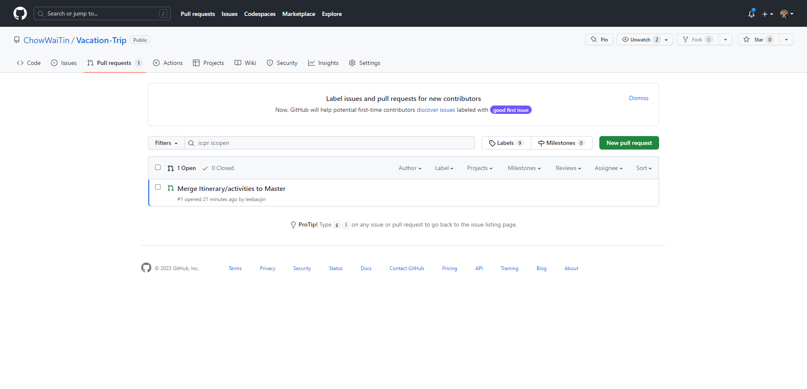

# Making a pull request

## Pre-requisite
1. Complete the previous tasks.

## Objective
1. Learn what is a pull request.
2. Learn how to perform a pull request.
3. Understand why pull request is used.

## Purpose of a Pull Request
1. Collaboration

    - Let others know about the changes pushed to a branch in a repository
    - Allow other collaborators to review any potential changes and make comments before the changes are merged into the main branch

## Storyline 5
1. After the different developers have performed their individual tasks in the respective branches, they decided to consolidate all of their work into a single final plan. However, they are worried that the previous issues that they have experienced when working with the repository will result in the final plan being incorrect. 

2. While searching for a solution, they found that it was possible to require a pull request before merger into the final `master` branch is allowed. The advantage of this is that they will be **able to review the changes made before the merger** and could settle any discrepancies.

3. Developer A plans to merge the "`itinerary/activities`" branch into the "`master`" branch. He starts of with changing his local branch to the `main` branch and ensure it is updated.

    - Switch branch with `git switch <branch_name>`

        ```
        git switch master
        ```

        

    - Update local `master` branch

        ```ps1
        # Fetch for changes
        git fetch origin
        # Pull changes
        git pull origin
        ```

        

4. Developer A switches to the "`itinerary/activities`" branch.

    - Checks the local branches `git branch`
        ```
        git branch -a
        ```
    - Switch branch with `git switch <branch_name>`
         ```
        git switch itinerary/activities
        ```

        

5. Developer A updates the "`itinerary/activities`" branch by merging the "`master`" branch into it

    - Merge `master` branch into `itinerary/activities` branch using `git merge <branch_to_merge>`

        ```
        git merge master
        ```

        If there are no updates to `master` since `itinerary/activities` was branched from it, it will indicate that the branch is already up to date.

        

6. Developer A updates the remote repository. 
    
    - Push to remote repository with `git push origin`

        ```
        git push origin
        ```

        If the local repository is up to date with the remote repository, there will be an indication that Everything up-to-date.

        

7. Developer A proceeds to create a **pull request** in github.

    - Developer A opens the github webpage and opens the repository.
    

    - Developer A clicks on the **Pull request** button to navigate to the pull request page.
    

    - Developer A clicks on the **New pull request** button to create a new request.
    

    - Developer A selects the branch he wish to merge (`itinerary/activities` branch) into the main branch  
    
    
    - The comparing changes page will appear. This list the commits and changes, which can be reviewed. Click **Create pull request** to create the pull request.
    
    

    - In the **Open a pull request page**, enter a title and comment
        
        Title
        ```
        Merge Itinerary/activities to Master
        ```

        Comment
        ```
        Merge completed itinerary activities to master.
        ```
        

    - Developer A clicks **Create pull request**
    

    - Developer A puts Developer B as a reviewer
    
    


8. Developer B was informed to review the repository.

    - Developer B opens the github webpage and opens the repository

        

    - Developer B clicks the **Pull request** button to navigate to the pull request page.

        

        

    - Developer B clicks on the pull request (red box) to be reviewed

        

    - Developer B is brought to the review pull request page

        

    - To begin the review of the pull request, Developer B clicks on the  button (red box) to review the changes made to the files by Developer A
        
        

        Developer B will brought to the "Files Changed" Section to review the changes made to each file.

        

    - Developer B noticed that Developer A added some new lines of text in the files (green box) and that a file was deleted (red boxs)

        

    - After looking through the changed files, Developer B acknowledged the changes made after viewing them by clicking on the  for each file that has changes

        

    - To proceed with finishing the review, Developer B clicked on , leave a comment review (highlighted in light blue), clicked on the Approve Button (highlighted in light blue) and clicked on the 

        
        
    - After seeing that the changes have been approved (highlighted in light blue), Developer B proceeds to merge the Pull Request by clicking on the 

        

    - Developer B proceeded to click on the merge pull request button (red box)

        

10. Developer A checks the `master` repository after the merger.

