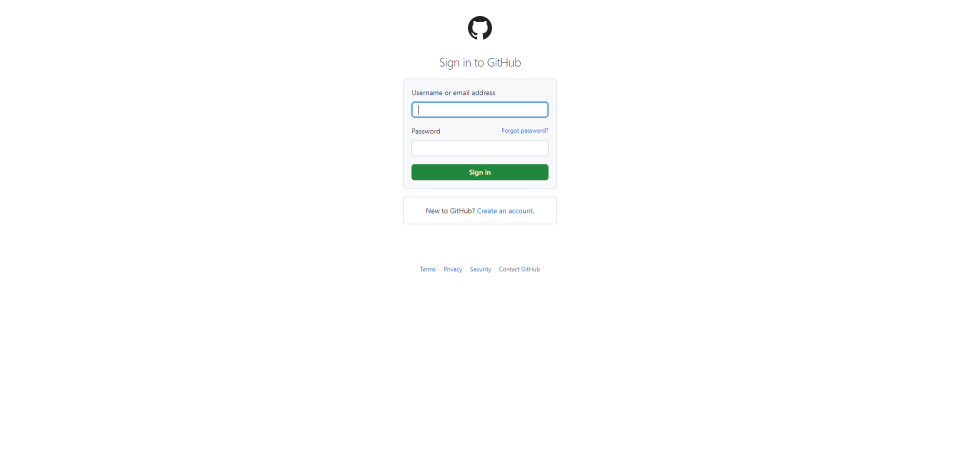
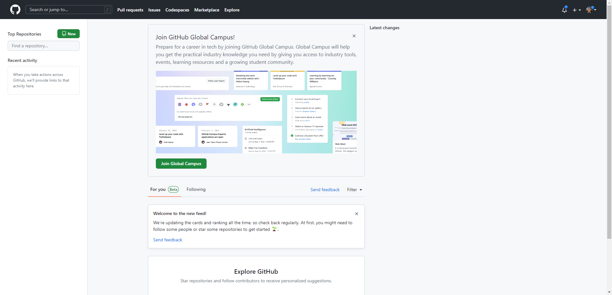
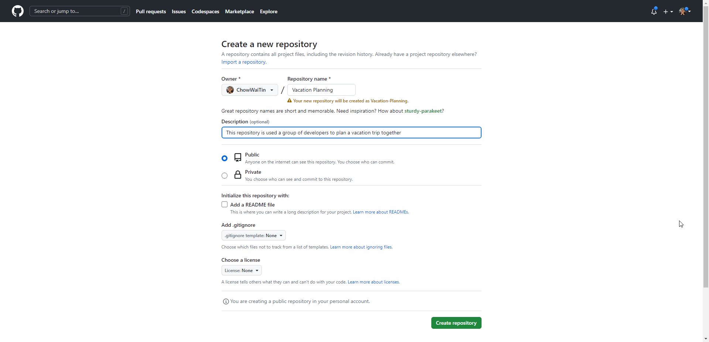

# Learning Git with Real-Life Applications

## Context of Real-Life Application
A group of developers decided to go on vacation trip together after their recent project has been deployed and commisioned. The lead developer of the developement team decided to use GitHub to store the details of their vacation trip such as the itenary, budget planning and etc.

## 1. Setting up the Pre-requisites
Before the team of developers can plan for their trip, the lead developer would need to ensure that the team would have the following things required:

- Having [Git Installed]() on their Local Device
- Having a [GitHub Account]()

## 2. Getting Started

### 2.1 Create a Repository
To create a repository for the planning of the trip, the lead developer can procceed by creating using the [Command Line Interface (CLI)](####2.1.1-via-the-command-line-nterface) or via the [GitHub Webpage](####2.1.2-via-the-gitHub-webpage) 

#### 2.1.1 Create A Remote Repository on GitHub Webpage
1. Login to [GitHub](https://github.com/login)

    

2. Click on  

    

3. Give the Repository a Name and Description, and Choose whether it should be Public or Private

    

#### 2.1.2 Creating A Local Repository on your Local Device
1. Create a Folder for the Planning of the Trip
    * Note: For a step-by-step guide, [click here](./2.%20Getting%20Started/2.1.2/Create_Folder_CLI.md)

2. Open the Window Command Line Interface (CLI)
    * Note: For a step-by-step guide, [click here](./2.%20Getting%20Started/2.1.2/Opening_Windows_CLI.md)

3. Use the  

After initialising the git repository, the developers would need to 

